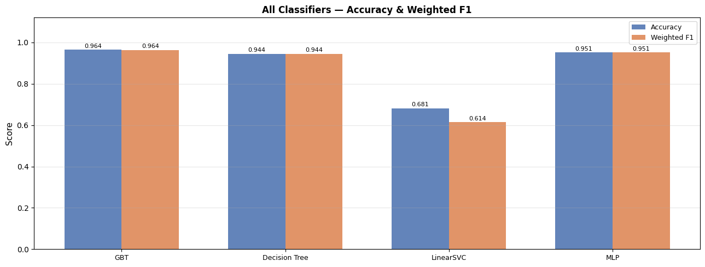
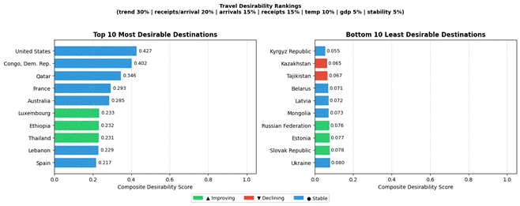
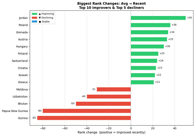
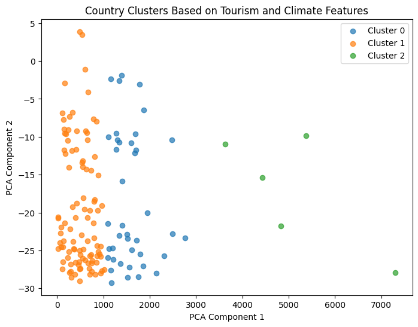
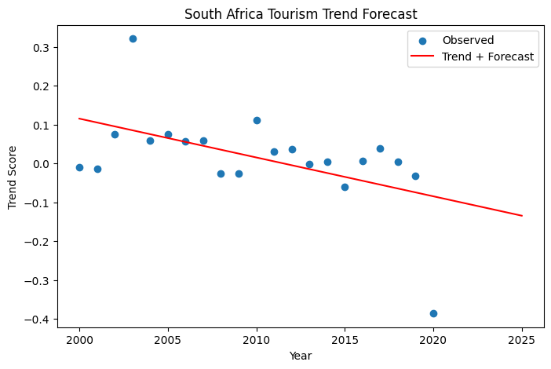

# Smart Voyage: Mining Global Tourism and Climate Data for Travel Desirability

**A PySpark data mining system that combines 20 years of tourism and climate data for 145 countries to classify, cluster, forecast and rank destinations by travel desirability.**

Final project for **CS 483: Big Data Mining**, University of Illinois Chicago (Spring 2026).
📄 [Read the full report](report/SmartVoyage_Final_Report.pdf)

---

## The problem

Popular travel destinations change over time as tourism demand, visitor spending and climate shift. We asked:

* Which countries are becoming **more or less desirable** to travel to?
* Which countries follow **similar tourism and climate patterns**?
* Where is each country's tourism **heading next**?
* How do countries **rank overall**, and who is gaining or losing momentum?

## Data and features

We merged two public datasets into a **country-year panel: 145 countries, 2000 to 2020** (see [`data/`](data/README.md)).

* **Tourism** (World Bank indicators via Kaggle): international arrivals, tourism receipts, GDP.
* **Climate** (Berkeley Earth): annual mean temperature per country.

Engineered features include year-over-year growth in arrivals, receipts and **receipts per arrival** (spending per visitor), temperature change, log-scaled levels, and 5-year rolling momentum slopes. The central derived metric is:

```
trend_score = 0.6 × arrivals_growth + 0.4 × receipts_per_arrival_growth
```

which combines demand growth with spending quality and feeds the classification, forecasting and ranking tasks.

## Four data mining approaches

```
Tourism + Climate ─► cleaned country-year panel (PySpark) ─┬─► 1. Classification: increasing / stable / decreasing
                                                           ├─► 2. Ranking: composite desirability score
                                                           ├─► 3. Clustering: groups of similar countries
                                                           └─► 4. Time series: per-country trend + forecast
```

### 1. Classification: is a destination's trend increasing, stable or decreasing?

Six Spark ML classifiers, trained in pipelines (imputation, vectorization, scaling) with an 80/20 **stratified** split, evaluated on accuracy and weighted F1.

The first version used fixed thresholds (trend_score ≥ 0.05 or ≤ -0.05) and reached only ~44% accuracy, because 44.6% of observations sat right at the class boundaries. We switched to **percentile-based labels** (bottom 20% decreasing, middle 60% stable, top 20% increasing) and an 18-feature set that adds the growth components of trend_score, log-scaled levels, 5-year momentum slopes and climate/GDP features. Accuracy rose above 90% for the nonlinear models.

| Model | Accuracy | Weighted F1 |
|---|---|---|
| **Gradient Boosted Trees** | **0.964** | **0.964** |
| Multilayer Perceptron | 0.951 | 0.951 |
| Decision Tree | 0.944 | 0.944 |
| Random Forest | 0.935 | 0.935 |
| Logistic Regression | 0.688 | 0.628 |
| LinearSVC | 0.681 | 0.614 |



Tree ensembles and the MLP beat linear models by roughly 25 points, showing that the relationship between growth, spending and the trend label is strongly nonlinear. See the note on this in [Limitations](#limitations-and-lessons-learned).

### 2. Ranking: which destinations are most desirable?

A composite desirability score over seven min-max-normalized indicators: trend_score (30%), receipts per arrival (20%), arrivals (15%), receipts (15%), plus temperature, GDP and climate stability (temperature change inverted so instability lowers the score). Countries are ranked twice, on their **2000 to 2020 average** and on their **most recent pre-COVID year** (2020 excluded as a pandemic outlier), and the difference shows who is gaining or losing momentum.



* **Top recent destinations:** United States (0.427), Congo Dem. Rep. (0.402), Qatar (0.346), France, Australia.
* **Biggest risers:** Jordan (+50 places), Poland (+36), Grenada (+34), Austria (+33), Hungary (+30).
* **Biggest fallers:** Guinea (-85), Papua New Guinea (-80), Bhutan (-50, after tourist fee policy changes).



### 3. Clustering: which countries behave alike?

K-Means on per-country averages of arrivals growth, receipts growth, spending growth and temperature change, visualized with PCA. k = 2 had the highest silhouette score (~0.92) but was too coarse, so we chose **k = 3 (silhouette ~0.80)** for more meaningful groups:



* **Cluster 0 (40 countries):** moderate, stable destinations with higher spending per visitor (e.g. Indonesia, Thailand, Maldives).
* **Cluster 1 (100 countries):** growing destinations with lower spending per visitor (e.g. France, Italy, UK).
* **Cluster 2 (5 countries):** premium destinations with the highest spending per visitor (e.g. Qatar, Luxembourg, Australia).

### 4. Time series: where is each country heading?

A linear regression trend line per country on its yearly trend_score, with the slope as momentum and RMSE as fit quality.

* **Median RMSE ~0.11, mean ~0.23** across 145 countries. Most countries fit well; a few volatile ones (max RMSE 5.44) pull the mean up.
* **Strongest upward momentum:** Congo Dem. Rep., Libya, Kiribati. **Strongest decline:** Sudan, Yemen, Tajikistan.
* Most stable fits: UAE, Germany, Switzerland.



## Limitations and lessons learned

* **The classification label is built from features the model can see.** `trend_score` is a weighted sum of `arrivals_growth` and `rpa_growth`, which are also input features, so the high accuracy mostly reflects the models learning that formula. A more realistic next step is to predict **next year's** trend class using only current and past features, with a time-based train/test split instead of a random one.
* Small or volatile tourism markets (for example Congo Dem. Rep. and Libya) can produce extreme growth rates that push them high in the rankings and trend slopes.
* Linear regression is a simple baseline for forecasting; ARIMA or multi-country models would handle volatile series better.
* The ranking weights were chosen by hand, and the data stops at 2020.

## Repository structure

```
├── notebooks/        # Full project notebook (see note below)
├── data/
│   ├── raw/          # Tourism.csv, Climate.csv
│   └── processed/    # cleaned_data.csv (merged panel with engineered features)
├── assets/           # Figures used in this README
├── report/           # Final report (PDF)
└── requirements.txt
```

## Running it

Built for **Google Colab** with PySpark (the notebook installs Java and PySpark itself).

1. Open the notebook in Colab.
2. Upload the files in `data/` and update the dataset paths at the top of the notebook.
3. Run the cells in order: cleaning → classification → clustering → time series → ranking.

## Tech stack

PySpark (Spark SQL, Spark ML) · pandas · NumPy · matplotlib · scikit-learn · Google Colab

## Team

Group project by **Muhammed Arabi, Shuroq Hussein and Sarah Syeda**.

* **Muhammed:** data cleaning, merging and feature engineering; initial classification models.
* **Shuroq:** K-Means clustering and PCA; time series trend estimation and forecasting.
* **Sarah (me):**
  * Diagnosed why the initial classifiers plateaued at ~44% accuracy (almost half the observations sat on the fixed class boundaries) and redesigned the task with **percentile-based labels**, stratified splitting and an expanded 18-feature set.
  * Built and compared **Logistic Regression, Random Forest, Decision Tree, Gradient Boosted Trees, LinearSVC and MLP** classifiers in Spark ML pipelines, with confusion matrices, a full model comparison and feature importance analysis.
  * Designed the **composite desirability ranking system**, including indicator weighting, normalization, average vs. recent rankings and rank-change analysis.

## References

* Zhou, W. et al. (2024). Meta-analysis of the climate change-tourism demand relationship. *Journal of Sustainable Tourism*, 32(9).
* Tourism and Economic Impact dataset, Kaggle.
* Berkeley Earth Surface Temperature data, Kaggle.
